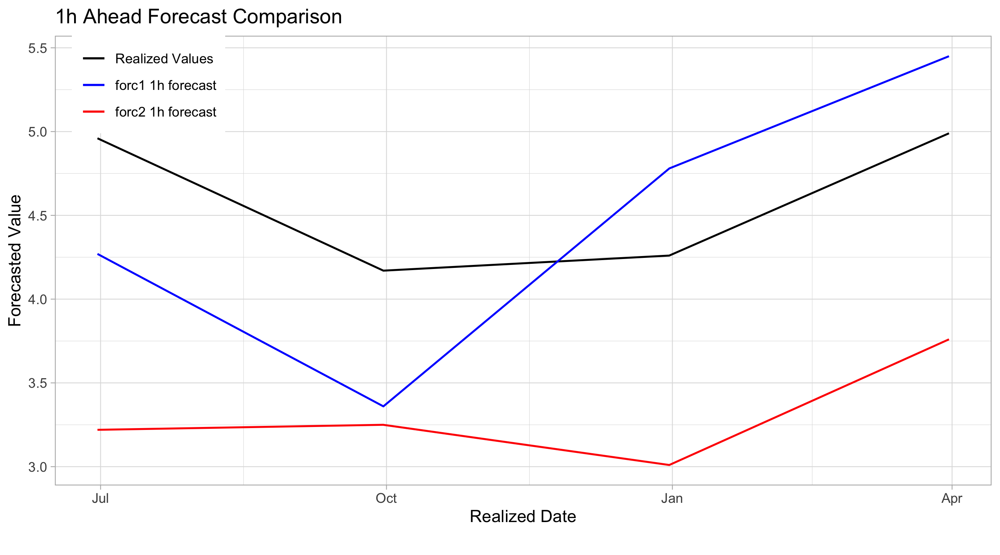

<!-- README.md is generated from README.Rmd. Please edit that file -->

# lmForc Helper Functions

``` r
library(lmForc)
```


Assorted functions for working with lmForc Forecast objects. The end
game is to integrate some of these functions into the lmForc package and
turn the rest of these functions into a standalone R package.

## Sections

#### [Subsetting Functions Overview](#subsetting-functions-overview-1)

#### [subset_forcs](#subset_forcs-1)

#### [subset_bytime](#subset_bytime-1)

#### [subset_identical](#subset_identical-1)

#### [Transformation Functions Overview](#transformation-functions-overview-1)

#### [convert_bytime](#convert_bytime-1)

#### [transform_bytime](#transform_bytime-1)

#### [convert_byh](#convert_byh-1)

#### [transform_byh](#transform_byh-1)

#### [Visualization Functions Overview](#visualization-functions-overview-1)

#### [accuracy_table](#accuracy_table-1)

#### [plot_forc](#plot_forc-1)

## Subsetting Functions Overview

``` r
source("lmForc_subset.R")
```

The Forecast class comes with a built in method for subsetting a single
Forecast object. This subsetting method takes numeric or logical values
and follows subsetting conventions that are present throughout the R
language.

`forc[2:4]` <br/> `forc[origin(forc1_1h) >= as.Date("2010-12-31")]`

However, one often ends up working with multiple Forecast objects.
Examples include working with different model forecasts for the same
forecast horizon, one model forecast for varying forecast horizons, or
both. The lmForc convention for working with multiple Forecast objects
is to put them into a list. The following functions provide a way to
subset lists of Forecast objects by various conditions.

#### Subsetting Example Dataset

Examples of lmForc subsetting functions utilize the following stylized
dataset. This example dataset contains one-quarter ahead forecasts
produced by two different models, `forc1` and `forc2`. Note that both
forecasts have identical `future`, `realized`, and `h_ahead` values, but
that the `origin` dates of the last two forecasts differ. This becomes
relevant when both forecast models are subset to identical `origin`
values.

``` r
forc1_1h <- Forecast(
  origin = as.Date(c("2010-02-17", "2010-05-14", "2010-07-22", "2010-12-05", "2011-03-10")),
  future = as.Date(c("2010-06-30", "2010-09-30", "2010-12-31", "2011-03-31", "2011-06-30")),
  forecast = c(4.27, 3.36, 4.78, 5.45, 5.12),
  realized = c(4.96, 4.17, 4.26, 4.99, 5.38),
  h_ahead = 1
)

forc2_1h <- Forecast(
  origin = as.Date(c("2010-02-17", "2010-05-14", "2010-07-22", "2010-12-22", "2011-03-27")),
  future = as.Date(c("2010-06-30", "2010-09-30", "2010-12-31", "2011-03-31", "2011-06-30")),
  forecast = c(4.01, 3.89, 3.31, 4.33, 4.61),
  realized = c(4.96, 4.17, 4.26, 4.99, 5.38),
  h_ahead = 1
)
```

## subset_forcs

The simplest way to subset multiple Forecast objects is via the
`subset_forcs()` function. This function takes a list of Forecast
objects and a numeric or logical index. All forecasts in the list are
subset by the numerical or logical values that are passed to the `index`
argument.

For example, a list of Forecast objects can be subset by a
condition:<br/>
`subset_forcs(forcs, origin(forc1_1h) >= as.Date("2010-12-31"))`

``` r
forcs <- list(forc1_1h, forc2_1h)

subset_forcs(forcs, 2:3)
#> [[1]]
#> h_ahead = 1 
#> 
#>       origin     future forecast realized
#> 1 2010-05-14 2010-09-30     3.36     4.17
#> 2 2010-07-22 2010-12-31     4.78     4.26
#> 
#> [[2]]
#> h_ahead = 1 
#> 
#>       origin     future forecast realized
#> 1 2010-05-14 2010-09-30     3.89     4.17
#> 2 2010-07-22 2010-12-31     3.31     4.26
```

## subset_bytime

One may want to compare forecasts over a specific time horizon. The
`subset_bytime()` function allows the user to subset multiple forecasts
based on `origin` or `future` values. After using the `slot` argument to
choose whether to subset by `origin` or `future` values, the user passes
a single time object or vector of time objects to the `values` argument.
All forecasts in the list of Forecast objects are subset by `values`.

For example, to see all of the forecasts that were made on a specific
date:<br/>
`subset_bytime(forcs, values = as.Date("2010-05-14"), slot = "origin")`

``` r
forcs <- list(forc1_1h, forc2_1h)
 
subset_bytime(
  forcs, 
  values = as.Date(c("2010-09-30", "2010-12-31", "2011-03-31")), 
  slot = "future"
)
#> [[1]]
#> h_ahead = 1 
#> 
#>       origin     future forecast realized
#> 1 2010-05-14 2010-09-30     3.36     4.17
#> 2 2010-07-22 2010-12-31     4.78     4.26
#> 3 2010-12-05 2011-03-31     5.45     4.99
#> 
#> [[2]]
#> h_ahead = 1 
#> 
#>       origin     future forecast realized
#> 1 2010-05-14 2010-09-30     3.89     4.17
#> 2 2010-07-22 2010-12-31     3.31     4.26
#> 3 2010-12-22 2011-03-31     4.33     4.99
```

## subset_identical

When comparing multiple forecasts, it is imperative that forecast
accuracy is compared across an identical time period. This can become
complicated if the `origin` and `future` values of multiple forecasts do
not always align. The `subset_identical()` function finds all
overlapping `origin` or `future` values in a list of Forecast objects
and subsets each of the forecasts to these overlapping values. This
leaves the user with a list of Forecasts that have either identical
`origin` values or identical `future` values depending on what the user
passes to the `slot` argument.

``` r
forcs <- list(forc1_1h, forc2_1h)

subset_identical(forcs, slot = "origin")
#> [[1]]
#> h_ahead = 1 
#> 
#>       origin     future forecast realized
#> 1 2010-02-17 2010-06-30     4.27     4.96
#> 2 2010-05-14 2010-09-30     3.36     4.17
#> 3 2010-07-22 2010-12-31     4.78     4.26
#> 
#> [[2]]
#> h_ahead = 1 
#> 
#>       origin     future forecast realized
#> 1 2010-02-17 2010-06-30     4.01     4.96
#> 2 2010-05-14 2010-09-30     3.89     4.17
#> 3 2010-07-22 2010-12-31     3.31     4.26
```

## Transformation Functions Overview

``` r
source("lmForc_transform.R")
```

Forecasts are often produced for multiple `h_ahead` horizons into the
future. For example, a model may produce a 1-quarter ahead, 2-quarter
ahead, 3-quarter ahead, and 4-quarter ahead forecast during each quarter
of the year. In this example, multiple Forecast objects are needed to
capture the forecast made during each quarter. As per lmForc convention,
one would work with these forecasts by putting them into a list. When
working with list of forecasts for multiple `h_ahead` horizons into the
future, there are two general formats in which the forecasts can be
organized. These two formats are: **Time Format** and **h_ahead
Format**.

#### Time Format

**Time Format** consists of a list of Forecast objects where each
forecast has homogenous `origin` or `future` values. Each Forecast
object in the list was made at the same time or contains forecasts for
the same future time. However, the `h_ahead` forecast horizon differs
within each Forecast object. **Time Format** is used to represent
forecasts made at a single `origin` time for multiple `h_ahead`
horizons.

The following is an example of forecasts in **Time Format**. Each
Forecast object represents a set of 1-quarter, 2-quarter, and 3-quarter
ahead forecasts made at a single `origin` time during each quarter of
2010. Note that because each Forecast object contains forecasts for
multiple `h_ahead` horizons, `h_ahead` is set to `NA`. We place all of
these forecasts into a list of Forecast objects that is in **Time
Format** and assign it to `forcs_time_format`.

``` r
forc1_t1 <- Forecast(
  origin = as.Date(c("2010-02-17", "2010-02-17", "2010-02-17")),
  future = as.Date(c("2010-06-30", "2010-09-30", "2010-12-31")),
  forecast = c(4.27, 3.77, 3.52),
  realized = c(4.96, 4.17, 4.26),
  h_ahead = NA
)

forc1_t2 <- Forecast(
  origin = as.Date(c("2010-05-14", "2010-05-14", "2010-05-14")),
  future = as.Date(c("2010-09-30", "2010-12-31", "2011-03-31")),
  forecast = c(3.36, 3.82, 4.22),
  realized = c(4.17, 4.26, 4.99),
  h_ahead = NA
)

forc1_t3 <- Forecast(
  origin = as.Date(c("2010-07-22", "2010-07-22", "2010-07-22")),
  future = as.Date(c("2010-12-31", "2011-03-31", "2011-06-30")),
  forecast = c(4.78, 4.53, 5.03),
  realized = c(4.26, 4.99, 5.33),
  h_ahead = NA
)

forc1_t4 <- Forecast(
  origin = as.Date(c("2010-12-22", "2010-12-22", "2010-12-22")),
  future = as.Date(c("2011-03-31", "2011-06-30", "2011-09-30")),
  forecast = c(5.45, 4.89, 5.78),
  realized = c(4.99, 5.33, 5.21),
  h_ahead = NA
)

forcs_time_format <- list(forc1_t1, forc1_t2, forc1_t3, forc1_t4)
```

### h_ahead Format

**h_ahead Format** consists of a list of Forecast objects where each
forecast has homogenous `h_ahead` values but the `origin` and `future`
values vary. The **h_ahead Format** is useful for analyzing forecasts at
a specific `h_ahead` horizon. For example, one may want to calculate the
forecast accuracy of 4-quarter ahead forecasts only. In this case it is
useful to have multiple forecasts arranged by homogenous `h_ahead`
values.

The following is an example of forecasts in **h_ahead Format**. Each
Forecast object represents all of the 1-quarter, 2-quarter, and
3-quarter ahead forecasts made during different quarters of 2010. Note
that because each Forecast object has a homogenous `h_ahead` horizon we
can now set `h_ahead` to the appropriate value. These forecasts are
collected into a list of Forecast objects that is in **h_ahead Format**
and assigned to `forcs_h_ahead_format`.

``` r
forc1_1h <- Forecast(
  origin = as.Date(c("2010-02-17", "2010-05-14", "2010-07-22", "2010-12-22")),
  future = as.Date(c("2010-06-30", "2010-09-30", "2010-12-31", "2011-03-31")),
  forecast = c(4.27, 3.36, 4.78, 5.45),
  realized = c(4.96, 4.17, 4.26, 4.99),
  h_ahead = 1
)

forc1_2h <- Forecast(
  origin = as.Date(c("2010-02-17", "2010-05-14", "2010-07-22", "2010-12-22")),
  future = as.Date(c("2010-09-30", "2010-12-31", "2011-03-31", "2011-06-30")),
  forecast = c(3.77, 3.82, 4.53, 4.89),
  realized = c(4.17, 4.26, 4.99, 5.33),
  h_ahead = 2
)

forc1_3h <- Forecast(
  origin = as.Date(c("2010-02-17", "2010-05-14", "2010-07-22", "2010-12-22")),
  future = as.Date(c("2010-12-31", "2011-03-31", "2011-06-30", "2011-09-30")),
  forecast = c(3.52, 4.22, 5.03, 5.78),
  realized = c(4.26, 4.99, 5.33, 5.21),
  h_ahead = 3
)

forcs_h_ahead_format <- list(forc1_1h, forc1_2h, forc1_3h)
```

## convert_bytime

Given a list of forecasts in **h_ahead Format**, one may want to convert
one or multiple of these forecasts into **Time Format**. The function
`convert_bytime()` takes a list of Forecast objects in **h_ahead
Format** and converts the forecasts made on the time specified in the
`value` and `slot` arguments into Forecast objects that are in **Time
Format**. Note that because we are converting to **Time Format**, the
`h_ahead` value in each Forecast object is changed to `NA`.

``` r
convert_bytime(
  forcs_h_ahead_format,
  value = as.Date(c("2010-07-22", "2010-12-22")),
  slot = "origin"
)
#> [[1]]
#> h_ahead = NA 
#> 
#>       origin     future forecast realized
#> 1 2010-07-22 2010-12-31     4.78     4.26
#> 2 2010-07-22 2011-03-31     4.53     4.99
#> 3 2010-07-22 2011-06-30     5.03     5.33
#> 
#> [[2]]
#> h_ahead = NA 
#> 
#>       origin     future forecast realized
#> 1 2010-12-22 2011-03-31     5.45     4.99
#> 2 2010-12-22 2011-06-30     4.89     5.33
#> 3 2010-12-22 2011-09-30     5.78     5.21
```

## transform_bytime

Given a list of forecasts in **h_ahead Format** one can convert all of
the forecasts to **Time Format** using the `transform_bytime()`
function. This function transforms all Forecast objects in `forcs` to a
list of **Time Format** Forecast objects that have homogenous `origin`
or `future` values depending on what the user specifies in the `slot`
argument. The difference between `transform_bytime()` and
`convert_bytime()` is that transforming automatically converts all
forecasts in the list while converting only converts the forecasts
specified by the user.

``` r
transform_bytime(forcs_h_ahead_format, slot = "origin")
#> [[1]]
#> h_ahead = NA 
#> 
#>       origin     future forecast realized
#> 1 2010-02-17 2010-06-30     4.27     4.96
#> 2 2010-02-17 2010-09-30     3.77     4.17
#> 3 2010-02-17 2010-12-31     3.52     4.26
#> 
#> [[2]]
#> h_ahead = NA 
#> 
#>       origin     future forecast realized
#> 1 2010-05-14 2010-09-30     3.36     4.17
#> 2 2010-05-14 2010-12-31     3.82     4.26
#> 3 2010-05-14 2011-03-31     4.22     4.99
#> 
#> [[3]]
#> h_ahead = NA 
#> 
#>       origin     future forecast realized
#> 1 2010-07-22 2010-12-31     4.78     4.26
#> 2 2010-07-22 2011-03-31     4.53     4.99
#> 3 2010-07-22 2011-06-30     5.03     5.33
#> 
#> [[4]]
#> h_ahead = NA 
#> 
#>       origin     future forecast realized
#> 1 2010-12-22 2011-03-31     5.45     4.99
#> 2 2010-12-22 2011-06-30     4.89     5.33
#> 3 2010-12-22 2011-09-30     5.78     5.21
```

Note that the output of `transform_bytime()` above is identical to the
list of Forecast objects in `forcs_time_format`. One can continually
transform between **Time Format** and **h_ahead Format** without losing
information. This is evidenced by the fact that: <br/>
`transform_bytime(forcs_h_ahead_format, slot = "origin") == forcs_time_format`
<br/> and <br/>
`transform_byh(forcs_time_format, h_aheads = c(1, 2, 3)) == forcs_h_ahead_format`

## convert_byh

The inverse of `convert_bytime()` is `convert_byh()`. Given a list of
forecasts in **Time Format** `convert_byh()` converts one or multiple of
these forecasts into **h_ahead Format**. The functions takes a list of
Forecast objects in **Time Format** and converts the forecasts specified
by the `index` argument into Forecast objects in **h_ahead Format**.
Because forecasts that are in **Time Format** do not have `h_ahead`
values, the function allows the user to assign `h_ahead` values to the
converted Forecast objects via the `h_aheads` argument.

``` r
convert_byh(forcs_time_format, index = 1:2, h_aheads = c(1, 2))
#> [[1]]
#> h_ahead = 1 
#> 
#>       origin     future forecast realized
#> 1 2010-02-17 2010-06-30     4.27     4.96
#> 2 2010-05-14 2010-09-30     3.36     4.17
#> 3 2010-07-22 2010-12-31     4.78     4.26
#> 4 2010-12-22 2011-03-31     5.45     4.99
#> 
#> [[2]]
#> h_ahead = 2 
#> 
#>       origin     future forecast realized
#> 1 2010-02-17 2010-09-30     3.77     4.17
#> 2 2010-05-14 2010-12-31     3.82     4.26
#> 3 2010-07-22 2011-03-31     4.53     4.99
#> 4 2010-12-22 2011-06-30     4.89     5.33
```

## transform_byh

Given a list of forecasts in **Time Format** one can convert all of the
forecasts to **h_ahead Format** using the `transform_byh()` function.
This function transforms all Forecast objects in `forcs` to a list of
**h_ahead Format** Forecast objects that have homogenous `h_ahead`
values. `h_ahead` values are assigned to each converted Forecast object
based on the values passed to the `h_aheads` argument. The difference
between `transform_byh()` and `convert_byh()` is that transforming
automatically converts all forecasts in the list while converting only
converts the forecasts specified by the user.

``` r
transform_byh(forcs_time_format, h_aheads = c(1, 2, 3))
#> [[1]]
#> h_ahead = 1 
#> 
#>       origin     future forecast realized
#> 1 2010-02-17 2010-06-30     4.27     4.96
#> 2 2010-05-14 2010-09-30     3.36     4.17
#> 3 2010-07-22 2010-12-31     4.78     4.26
#> 4 2010-12-22 2011-03-31     5.45     4.99
#> 
#> [[2]]
#> h_ahead = 2 
#> 
#>       origin     future forecast realized
#> 1 2010-02-17 2010-09-30     3.77     4.17
#> 2 2010-05-14 2010-12-31     3.82     4.26
#> 3 2010-07-22 2011-03-31     4.53     4.99
#> 4 2010-12-22 2011-06-30     4.89     5.33
#> 
#> [[3]]
#> h_ahead = 3 
#> 
#>       origin     future forecast realized
#> 1 2010-02-17 2010-12-31     3.52     4.26
#> 2 2010-05-14 2011-03-31     4.22     4.99
#> 3 2010-07-22 2011-06-30     5.03     5.33
#> 4 2010-12-22 2011-09-30     5.78     5.21
```

Note that the output of `transform_byh()` above is identical to the list
of Forecast objects in `forcs_h_ahead_format`. One can continually
transform between **Time Format** and **h_ahead Format** without losing
information. This is evidenced by the fact that: <br/>
`transform_byh(forcs_time_format, h_aheads = c(1, 2, 3)) == forcs_h_ahead_format`
<br/> and <br/>
`transform_bytime(forcs_h_ahead_format, slot = "origin") == forcs_time_format`

## Visualization Functions Overview

``` r
source("lmForc_visualize.R")
```

When analyzing forecast models, two common strategies are to compare
forecast accuracy and look at plots of forecasted and realized values.
However, when comparing multiple forecast models across multiple
`h_ahead` forecast horizons, the number of Forecast objects that one has
to consider can quickly get out of hand and analyzing forecasts becomes
tedious. The following functions are designed to simplify the process of
comparing forecast models.

## accuracy_table

If one is analyzing a single forecast model at various `h_ahead`
forecast horizons, these forecasts can be contained in a list of
Forecast objects that is in **h_ahead Format**. If the number of
forecast models being analyzed increases to more than one model, than
the process above may be repeated and all **h_ahead Format** lists may
be combined into a list of lists. The index of the outer list refers to
the various Forecast models and the index of the inner list refers to
the `h_ahead` forecast made by each model. The `accuracy_table()`
function takes this list of list and converts it into a data.frame
showing forecast accuracy across various forecast models and `h_ahead`
forecast horizons. The output data.frame contains one column for each
forecast model and one row for each of the forecast horizons that the
user passes to the `horizon` argument. Note that the order of the
Forecast objects in each list matters. If one of the integers in the
horizon argument is 4, then the function will compute the forecast
accuracy of each Forecast object at index 4 of the inner list and output
these values as one row in the output data.frame. If the Forecast
objects in the inner list are unordered or of incomparable length, the
output data.frame will not contain fair accuracy comparisons. The
accuracy of each forecast is computed based on the forecast accuracy
function that the user passes to the `metric` argument.

Another forecast model `forc2` that consists of an **h_ahead Format**
forecast list is added below to demonstrate how `accuracy_table()` can
be used to calculate forecast accuracy across multiple forecast models
and `h_ahead` forecast horizons.

``` r
forc2_1h <- Forecast(
  origin = as.Date(c("2010-02-17", "2010-05-14", "2010-07-22", "2010-12-22")),
  future = as.Date(c("2010-06-30", "2010-09-30", "2010-12-31", "2011-03-31")),
  forecast = c(3.22, 3.25, 3.01, 3.76),
  realized = c(4.96, 4.17, 4.26, 4.99),
  h_ahead = 1
)

forc2_2h <- Forecast(
  origin = as.Date(c("2010-02-17", "2010-05-14", "2010-07-22", "2010-12-22")),
  future = as.Date(c("2010-09-30", "2010-12-31", "2011-03-31", "2011-06-30")),
  forecast = c(3.53, 3.88, 4.01, 4.05),
  realized = c(4.17, 4.26, 4.99, 5.33),
  h_ahead = 2
)

forc2_3h <- Forecast(
  origin = as.Date(c("2010-02-17", "2010-05-14", "2010-07-22", "2010-12-22")),
  future = as.Date(c("2010-12-31", "2011-03-31", "2011-06-30", "2011-09-30")),
  forecast = c(3.89, 4.04, 4.21, 4.40),
  realized = c(4.26, 4.99, 5.33, 5.21),
  h_ahead = 3
)

forcs2_h_ahead_format <- list(forc2_1h, forc2_2h, forc2_3h)

accuracy_table(
  forcs = list(forcs_h_ahead_format, forcs2_h_ahead_format),
  horizon = c(1, 2, 3),
  metric = "rmse",
  colnames = c("forc1", "forc2"),
  rownames = c("1h", "2h", "3h")
)
#>        forc1     forc2
#> 1h 0.6352559 1.3180857
#> 2h 0.4355456 0.8878063
#> 3h 0.6235784 0.8587636
```

## plot_forc

The `plot_forc()` functions allows one or multiple Forecast objects to
be easily plotted. This functions takes a single Forecast object or a
list of Forecast objects and returns a ggplot with forecasted and
realized values on the y-axis and `future` values on the x-axis. The
ggplot call is returned to the console and the data.frame used to render
the ggplot may be optionally returned with the `return_df` argument.
These features allow the user to manually edit the plot afterwards if
necessary. `plot_forc()` also supports the alteration of various plot
aesthetics via arguments such as `labels` and `colors`.

``` r
library(ggplot2)

plot_forc(
  forcs = list(forc1_1h, forc2_1h),
  labels = c("forc1 1h forecast", "forc2 1h forecast"),
  colors = c("blue", "red"),
  xlab = "Realized Date",
  ylab = "Forecasted Value",
  title = "1h Ahead Forecast Comparison"
)
#> ggplot(data = df, aes(x = future)) + 
#>     geom_line(aes(y = realized, colour = 'Realized Values'), lwd = 0.6) + 
#>     geom_line(aes(y = forc1, colour = 'forc1 1h forecast'), lwd = 0.6) + 
#>     geom_line(aes(y = forc2, colour = 'forc2 1h forecast'), lwd = 0.6) + 
#>  scale_color_manual(
#>     breaks = c('Realized Values', 'forc1 1h forecast', 'forc2 1h forecast'), 
#>     values = c('black', 'blue', 'red')
#>   ) + 
#>   labs(title = '1h Ahead Forecast Comparison', 
#>     x = 'Realized Date', 
#>     y = 'Forecasted Value', 
#>     caption = '',
#>     colour = NULL
#>   ) + 
#>   theme_light() + 
#>   theme(legend.position = c('0.1', '0.9'))
```


